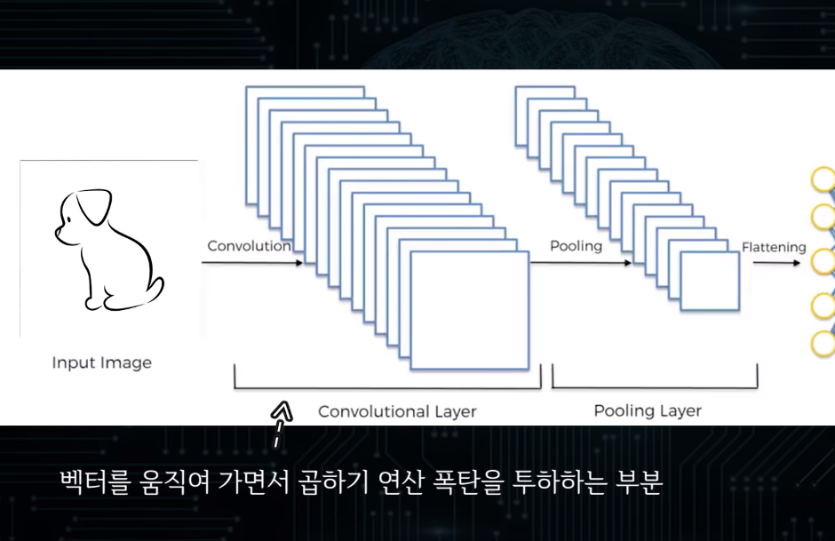

# 인공지능(Artificial Intelligence)

> 요즘 매우 핫하다는 인공지능에 대해 알아보고자 합니다.
>
> 사실 개념도 정확히 알고 있지 못해서 이참에 확실히 정리 하고 넘어가보자 하는 마음에서 정리와 공부를 시작합니다.🙂
>
> 배움에는 끝이 없지만 그래도 전체적인 그림을 그려 나가며 공부하는 게 참 중요한 것 같습니다.
>
> 본 내용은`Haesun Park - 핸즈온 머신러닝2` 와 `코딩하는 거니 - 인공지능 머신러닝의 모든것[고지식-거니] `내용을 바탕으로 작성 되었습니다. 😃

## 1. 인공지능이란?

위키백과에 의하면 인공지능의 정의는 아래와 같이 정의됩니다.

**인공지능**(artificial Intelligence, **AI**)은 인간의 학습능력, 추론능력, 지각능력, 논증능력, 자연언어의 이해능력 등을 인공적으로 구현한 컴퓨터 프로그램 또는 이를 포함한 컴퓨터 시스템이다. 하나의 인프라기술이기도 하다. 인간을 포함한 동물이 갖고 있는 지능 즉, natural intelligence와는 다른 개념이다.

이처럼 인공지능이라는 것은 인공적으로 구현한 컴퓨터 프로그램입니다. 인공적으로 이해 능력을 만들려면 크게 2가지의 방법으로 컴퓨터를 학습 시킬 수 있습니다. 

- 기계학습의 2가지 방법(인공적으로 구현한 컴퓨터 프로그램의 학습 방법)

  .png)

  1. 사람에 의해 학습 

     - 대표적인 예로는 심심이가 있을 수 있습니다.
     - 심심이는 단어에 대한 학습방법을 사람이 직접 입력해서 처리하는 방법입니다.
     - 따라서 `어떤 단어는 어떻게 처리해라` 라는 조건문을 이용해서 하나하나 일일이 사람이 직접 코드를 짜서 학습시키는 방법이 있습니다.   

     .png)

     .png)

  

  2. 스스로 학습 
     - 기계학습의 경우 스몰데이터이던지 빅데이터 이던지 **데이터를 가지고 통계를 낸 후 통계에 들어있지 않은 데이터를 입력받았을 때 저장되어있는 데이터를 기반으로 결과값을 예측해 준다는 것**에 있어서 심심이와는 다르게 **모든 상황을 처리해 주지 않아도 된다**는 큰 차이가 있습니다. 
     - 따라서 matlab과 tensorflow가 매우 유사한 것도 이 떄문인 것 같습니다. 
     - 위와 같은 이유로 수학과 통계에 기반인 머신러닝이 대두되고 있는 이유입니다. 

  .png)

  .png)

  기계는 자신이 터득한 경럼을 바탕으로 결과값을 보여줍니다. 

## 2. 딥러닝(Deep Learning)

기존의 간단한 기계학습방법에서 기계를 더욱 강력하게 사람 보다 월등히 뛰어난 수준으로 한 단계 더 발전시켜 보자 라고 해서 더 강력한 학습 방법에 대해 기대하고 있습니다. 

위에서 언급한 간단한 예시 말고 좀 더 고차원적으로 문제를 해결하는 학습지능을 만들고 싶었던 것이죠.

시대적으로는 준비가 되어있습니다. 

#### 넘쳐나는 데이터로 진하게 기계를 학습시켜보자고 대두됐던 기술이 바로 딥러닝(Deep Learning)입니다. 

현재로서는 가장 널리 사용되고 있는 분야는 사실 딥러닝입니다. 

.png)

### 2.1 신경망 

> 출처 : https://roboreport.co.kr/%EC%8B%A0%EA%B2%BD%EB%A7%9D-%EC%9D%B4%EB%A1%A0-%EC%9D%B4%ED%95%B4%ED%95%98%EA%B8%B0-1-perceptron/

딥러닝의 뿌리는 사실 신경망 이론에서 나왔습니다.

그렇지만 왜 이름이 딥러닝이 되었느냐? 신경망 이론에 대한 인지도가 낮아지니까 혁신적으로 보완하면서 만들어 냈던 개념을 바탕으로 이름을 딥러닝(Deep Learning)이라고 부르게 되었습니다. 

~~딥하다..딥러닝~~

### 신경세포의 구조

신경망 알고리즘은 실제로 신경세포(뉴런, neuron)의 모양과 작동 방식을 따라 만들어졌습니다. 

뉴런이 두개 이상 모이면 신경이 되며, 모든 뉴런은 수상돌기, 신경세포체, 축색돌기로 구성되어 있습니다. 뉴런의 구조는 아래 그림을 확인해주세요.

뉴런의 기본 기능은 자극을 받았을 경우 전기를 발생시켜 다른 세포에 정보를 전달하는 것으로 이렇게 발생하는 전기 신호를 `활동전위(action potential)`이라고 합니다.

뉴런에서 수상돌기로 입력받은 신호들의 강도의 합이 어느 설정치(threshold, 역치 값) 이상이면 축색돌기로 신호를 전달하고 이하면 전달(출력)하지 않습니다. 이렇게 전달된 축색돌기의 신호는 시냅스로 이어진 다른 뉴런들에게 전달되게 됩니다.

### Perceptron

Perceptron은 위에 설명한 neuron의 구조를 그대로 본따서 만들어졌습니다.

neuron이 수상돌기에서 입력을 받는 부분은 perceptron에서는 X 값으로 표현되고, neuron의 세포체의 가중합은 X의 각 유닛과 연결된 연결 가중치의 곱의 합으로 표현되고, 마지막으로 임계치를 넘으면 신호를 전달하는 부분은 활성화 함수라고 하는 함수에 의하여 출력 값을 얻도록 표현되었습니다. (아래 표 참조)

그럼 perceptron의 실제 작동 방식을 확인해보겠습니다.

1. input A의 값들은 각 unit(a1, a2, a3 …) 의 각자의 가중치(w1, w2, w3 … ) 값에 곱해져서 더해집니다. (weighted sum)
2. 1의 값에 bias가 더해집니다.
3. 이렇게 더해진 값은 활성화 함수(activation function)의 input값이 되서 최종 출력 값이 나오게 됩니다.

예를 들어 보겠습니다.

input으로 티셔츠 이미지의 각 픽셀의 값이 들어가고 최종적으로 티셔츠의 색이 밝은 색인지, 어두운 색인지 판결하는 perceptron이 있다고 해보겠습니다.

`X` 값과 `weight`를 더해서 나온 식의 값이 -0.1을 넘으면 밝은 색 (+1)으로 아니면 어두운 색(-1)이라고 분류하고 있습니다. 

여기서 `weight`는 각 연결의 강도를 의미합니다.

X의 양수의 값들이 더해졌으니 당연히 예시로 들어온 티셔츠는 밝은 색으로 분류가 됩니다.

기계학습으로 `클래스 예측을 한다는 것`은 간단하게 말하자면 `인스턴스들의 클래스를 구분짓는 선(decision boundary) 을 찾는 것`입니다.

perceptron은 선형결합(linear combination)을 f(x)로 사용하기 때문에 linear binary classifier 입니다.

위와 같이 직선으로 클래스를 구분할 수 있는 데이터라면 문제가 없지만 클래스가 뒤섞여 있을 때도 직선인 decision boundary를 사용할 수 밖에 없다는 한계가 존재합니다.

이런 perceptron의 한계점을 극복하기 위해 `MLP(다층 신경망)`이 나오게 됩니다. 

아래의 출처에 웹브라우저에서 신경망을 이용할 수 있는 사이트를 연결 해 놓겠습니다. 좀 더 능숙해진다면 한 번쯤 사용해 보세요🙂

[https://playground.tensorflow.org/#activation=tanh&batchSize=10&dataset=circle&regDataset=[…\]se&problem=classification&initZero=false&hideText=false](https://playground.tensorflow.org/#activation=tanh&batchSize=10&dataset=circle&regDataset=reg-plane&learningRate=NaN&regularizationRate=0&noise=20&networkShape=8,8,8,8,8,8&seed=0.22796&showTestData=false&discretize=true&percTrainData=50&x=true&y=true&xTimesY=true&xSquared=true&ySquared=true&cosX=false&sinX=true&cosY=false&sinY=true&collectStats=false&problem=classification&initZero=false&hideText=false)

위의 신경망 이론을 바탕으로 딥러닝을 이해하 보자면 아래의 사진을 참고해 볼 수 있겠습니다. 

.png)

.png)

결국 신경망 학습을 기반으로 사전훈련법이 만들어지고 사람들의 인식에 신경망은 도태되었다는 이미지가 강해 `딥러닝(Deeping learning)`으로 이름을 바꾸게 됐습니다! 

 또 `CNN`과정 중에 벡터를 옮겨 가며 계속 곱하기 연산을 하는 과정에서 `GPU`가 사용됩니다.

## 3. 인공지능의 분류 

인공지능은 크게 3가지로 분류해 볼 수있습니다. 

.png)

- 약인공지능
  - .png)
- 강인공지능
  - .png)
- 초인공지능
  - .png)

## 4. 마무리하며

간단하게 인공지능에 대한 개념과 머신러닝에 대해 배웠습니다.

이론적으로는 다 알게 됐지만 실습은 어떻게 진행 되어야 하는지 수업을 통해 또 README를 정리 보도록 하겠습니다 🙂